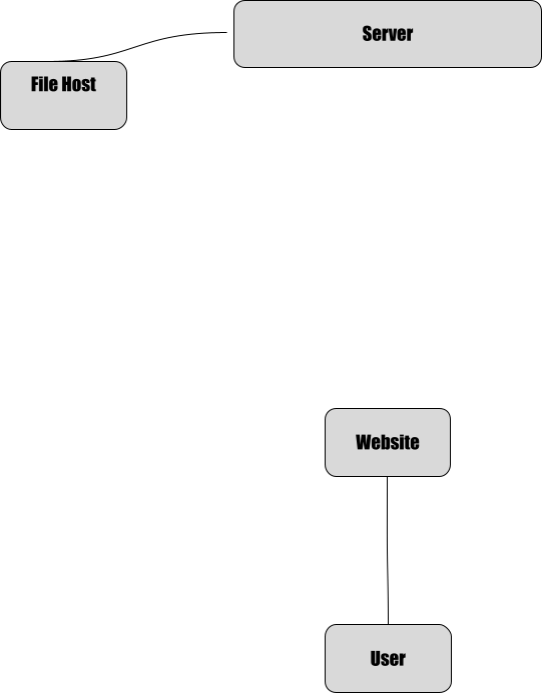
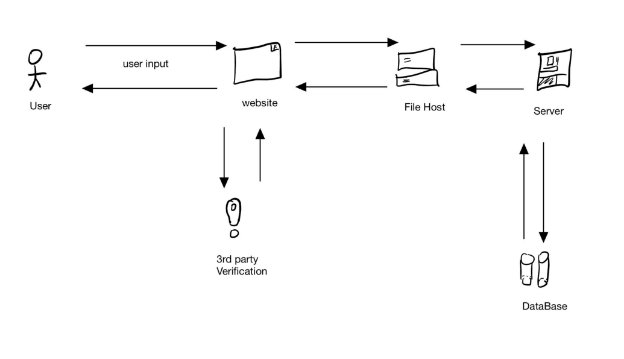

# QuickChat
**CPSC-362 Software Engineering Project: Online Chat Application**

## Product Vision

**For** individuals and organizations that need fast and secure communication across online devices, **the** "QuickChat" app is a real-time chat application **that** enables users to message each other in real-time through both public and private chat rooms, private messaging, and creating profiles with usernames and avatars. **Unlike** other traditional messaging apps, **our product** offers an easy-to-use interface, suitable for both personal and business use.

---

## Functional Requirements

### Business Requirements
- The application must scale to accommodate a growing user base, supporting 1 million active users by the first year, and continue scaling for any additional users.
- A free-to-use service may be accepted for rapid customer growth, but the application must generate profits by the 5th year.
- The chat application must result in long-term profit for the business.

### User Requirements
- Users can register in the app with their email, username, and password.
- Registered users can log into the system with their credentials.
- Users can send messages in near real-time.
- Users can join public and private chat rooms.
- Users can send images and files within both group chats and private messages.
- Users must be over the age of 13 to register for an account.

---

## Non-Functional Requirements

### Business Requirements
- A buy-out of the company (for its customer data) may be a way to monetize.
- Selling customer data directly to advertisers may also be a way to generate revenue.
- Banner ads and paid services (for features such as unlimited image uploads or personalized profiles) can provide scaling revenue.

### System Requirements
- User information must be stored in an encrypted and redundant database.
- The system must implement email or phone verification to deter spam accounts.
- The application must limit file and image sizes and quantity (e.g., max transfer of 5 megabytes per 10 minutes).
- The system must be compatible with major web browsers like Chrome.
- The system must deliver messages with a latency of under 5 seconds, even during peak usage.
- The user interface must be intuitive, with clear buttons for actions and tasks.

---

## Context Diagrams

### Context Diagram 1

### Context Diagram 2

---

## To-Do List

- Add the project/product vision.
- Add 5+ project requirements (both functional and non-functional) in use case & user story format.
- Add a context diagram with all actors and details to depict the entire system.

---

## Submission

- A `.zip` file containing the project repository (including the README.md file).
- A link to the GitHub repository (with the README.md file).